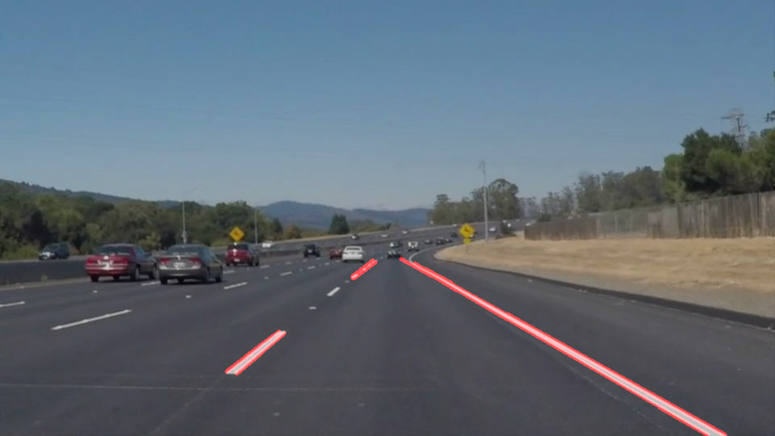
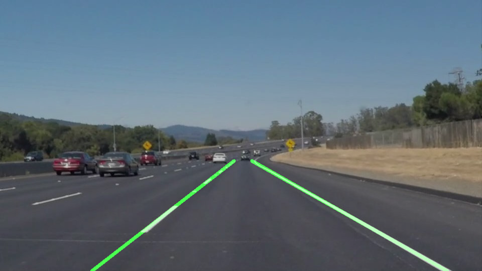

# Finding Lane Lines on the Road

**Finding Lane Lines on the Road**

The goals / steps of this project are the following:
* Make a pipeline that finds lane lines on the road
* Reflect on your work in a written report

---

## File info.

You can check my work by opening the **P1-Jongwon.ipynb** file. The result videos are in **test_videos_output** folder.

---

## Pipeline

My lane finding algorithm  is consist of 3 steps. Each steps are as follows.

1. Canny Edge Detection
2. Hough Transform
3. Averageing and extrapolation for making unified left/right lane

Details of each step are:

* **Canny Edge Detection**

I used the Canny edge detection method I learned in this course. 

First, input image is converted to grayscale image by helper function.
After that, gray image is smoothed by the GaussianBlur function in order to reduce noise. Kernel_size for Gaussian smoothing is 5.

After smoothing the input image, canny edge detection fucntion in opencv library is used to find edges of image. low threshold is 50 and high threshold is 150. Parameters are choosed by multiple tries and performance check.

Region of interest is trapezoidal shape. It is obtained by **cv2.fillPoly()** function and restricted to inside of 4 points (0, 540), (460, 320), (460, 320), (960, 540). It is set in the area where most lanes appear.

Python code of edge detection and the image after execution are below.

```python
blur_kernel_size = 5
image_blur = gaussian_blur(image_grey,blur_kernel_size)

low_threshold = 50
high_threshold = 150
edges = canny(image_blur, low_threshold, high_threshold)

vertices = np.array([[(0,imshape[0]),(460, 320), (500, 320), (imshape[1],imshape[0])]], dtype=np.int32)
edges_masked = region_of_interest(edges,vertices)
```


* **Hough Transform**

In order to find lines on image, Hough trasnfrom is implemented through knowledge of this course. I used **cv2.HoughLinesP()** function in opencv library. You can see the parameters of Hough trasnfrom in the python code below. I tried many combinations of parameters to find lines. And the result is below.

```python
rho = 2 
theta = np.pi/180 
threshold = 15     
min_line_length = 20 
max_line_gap = 10

lines = cv2.HoughLinesP(edges_masked, rho, theta, threshold, np.array([]),min_line_length, max_line_gap)
lines_image = np.zeros((imshape[0], imshape[1], 3), dtype=np.uint8)

draw_lines(lines_image, lines, color=[255, 0, 0], thickness=3)
lines_edges = weighted_img(lines_image,image)
```




* **Averageing and extrapolation**

In order to make the solid line in each side, Averaging and extrapolation method is implemented to the lines found by Hough trasnfrom. I modified the **draw_lines** function and made **draw_lines2** fuction. Averaging and extrapolation functions are in **draw_lines2**.
This function is consisted of several steps.

First, I divided image into 2 regions to distinguish the right/left lane. Regions are separated based on the vertical median line. The center points of each lines is used to determine which side the line is located. And center position, slope, length of each lines are stored in seperarted list based on right/left lines. You can see the python code of this step below.

```python
left_lines_mb = []
right_lines_mb = []
for line in lines:
    line_ = line[0]
    center = np.array([(line_[0]+line_[2])/2, (line_[1]+line_[3])/2])
    slope = (line_[1]-line_[3])/(line_[0]-line_[2])
    length = np.sqrt((line_[1]-line_[3])**2 + (line_[0]-line_[2])**2)
    if center[0] > imshape[1]/2.0:
        right_lines_mb.append(np.array([center[0], center[1], slope, length]))
    else:
        left_lines_mb.append(np.array([center[0], center[1], slope, length]))
        
right_lines_mb = np.asarray(right_lines_mb)
left_lines_mb = np.asarray(left_lines_mb)
```

After distinguishing the right/left lines, I averaged the line data in each side. I used weighted average. The weight is determined by the length of line. That means the longer line is more important and has the big imfluence to find the final lane. This can reduce the impact of short outlier lines. In addition, lines with a slope of 10 degrees or less are excluded to obtain an average. This was added by observing that the near-horizontal lines has a bad influence on the overall slope calculation. 

After averaging, the center position and slope of the right / left lane can be obtained. You can see the code below.

```python
# Average the right line data using weight(length)
x_sum = 0.
y_sum = 0.
slope_sum = 0.
length_sum = 0.
for i in range(len(right_lines_mb)):
    if (np.isinf(right_lines_mb[i,2]) == False) and (right_lines_mb[i,2] > 0.17):
        x_sum += right_lines_mb[i,0]*right_lines_mb[i,3]
        y_sum += right_lines_mb[i,1]*right_lines_mb[i,3]
        slope_sum += right_lines_mb[i,2]*right_lines_mb[i,3]
        length_sum += right_lines_mb[i,3]

x_ave_right = x_sum/length_sum
y_ave_right = y_sum/length_sum
slope_ave_right = slope_sum/length_sum

# Average the left line data using weight(length)
x_sum = 0.
y_sum = 0.
slope_sum = 0.
length_sum = 0.
for i in range(len(left_lines_mb)):
    if (np.isinf(left_lines_mb[i,2]) == False) and (left_lines_mb[i,2] < -0.17):
        x_sum += left_lines_mb[i,0]*left_lines_mb[i,3]
        y_sum += left_lines_mb[i,1]*left_lines_mb[i,3]
        slope_sum += left_lines_mb[i,2]*left_lines_mb[i,3]
        length_sum += left_lines_mb[i,3]

x_ave_left = x_sum/length_sum
y_ave_left = y_sum/length_sum
slope_ave_left = slope_sum/length_sum
```

Extrapolation was implemented by calculating end points of both lanes. Both ends of the lane can be calculated using the averaged center position and slope. The final lane result is completed by drawing a line using both ends. You can see the code and the result image below.

```python
# Calcuarate the end point of each lane (extrapolation)
y1 = imshape[0]
y2 = 320
right_points = np.array([np.int((y1-y_ave_right)/slope_ave_right+x_ave_right), y1 \
                            ,np.int((y2-y_ave_right)/slope_ave_right+x_ave_right), y2])
left_points = np.array([np.int((y1-y_ave_left)/slope_ave_left+x_ave_left), y1 \
                            ,np.int((y2-y_ave_left)/slope_ave_left+x_ave_left), y2])
extrapolation_line = np.vstack((right_points, left_points))
extrapolation_line = extrapolation_line.reshape([2,1,4])

for line in extrapolation_line:
    for x1,y1,x2,y2 in line:
        cv2.line(img, (x1, y1), (x2, y2), color, thickness)
```




---

## Shortcomings

The first shortcoming that I can see is that as the image is shaken, the lane result is shaked. This is because the height and pitch of the camera are moved while the vehicle is moving. For better control, it is desirable that the lane detection position is stable. This phenomenon occurs because the current lane detection algorithm uses only one frame.

The second shortcoming is that the dotted lane tends to be a little inaccurate due to the small number of detected lines. If the lane is a dotted line, the number of lines detected by the Hough trasform is small. And most of them are short. Therefore, when using averaging and extrapolation, the estimated lane does not fit actual lane. It is necessary to further improve the performance of the line detection function.

---

## Possible improvements

Regarding the first shortcoming, using previously determined lane data can solve the problem that the detected lane is shaken. It is possible to obtain an effect of suppressing sudden change by fusing the current and past detection result. There are various ways of fusion. A moving average, low-pass filter, and Kalman filter can be the solution. The easiest way to implement is the moving average. The moving average method accumulate the estimated result and averages them. This makes the estimated lane stable and suppresses the change. However, there is a possibility that it may not respond to situations where the position of the lane is actually changing rapidly. Thus, the Kalman filter method, which models the motion of the vehicle, will perform more well in various situations.