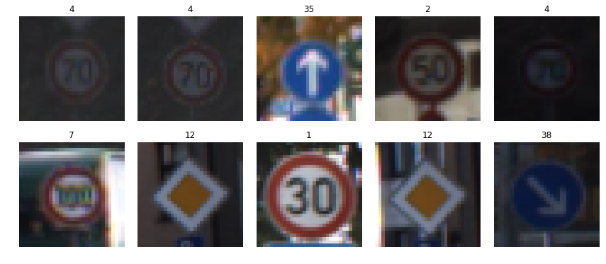
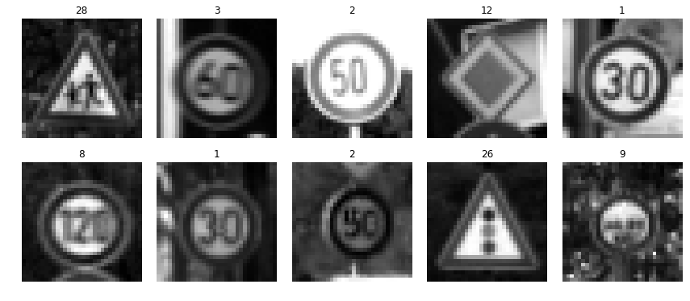
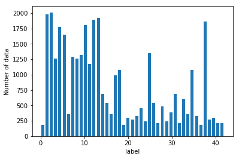
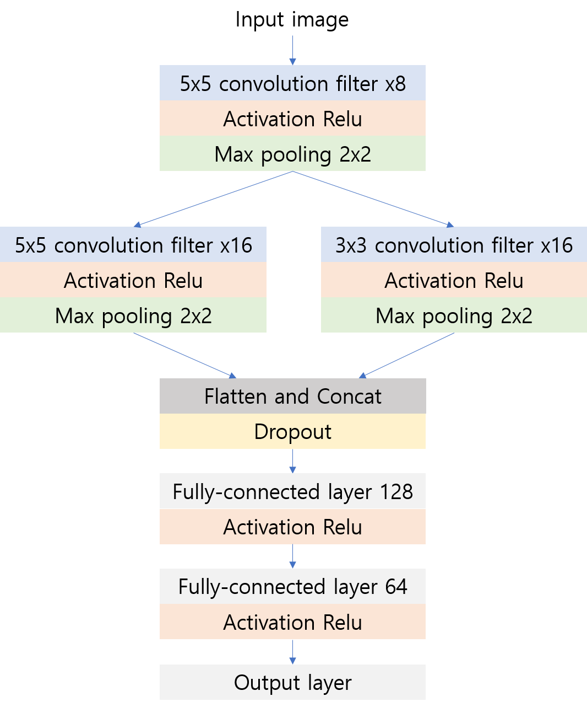
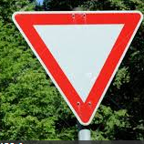
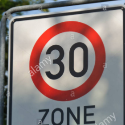

# Traffic_Sign_Classifier

**Traffic_Sign_Classifier**

The goals / steps of this project are the following:
* Classifying the traffic signs based on German Traffic Sign Dataset.

---

## File info.

You can check my work by opening the **Traffic_Sign_Classifier_jongwon.ipynb** file.

---

## Pipeline

My algorithm  is consist of 3 steps. Each steps are as follows.

1. Preparing the training data set
2. Training the convolutional neural network and Performance Verification
3. Testing the New images from web 

Details of each step are:

* **Preparing the training data set**

In this project, I used the German Traffic Sign Dataset. You can see it below.



Instead of using the images as it is, I changed it to gray image. I thought that gray image is more easy to train. Consequently it has better performance compared to RGB image. You can see the gray images below.



I used the following code to get a gray image. It also consist normalization code.

```python
X_train = X_train/128.0 - 1.0
X_valid = X_valid/128.0 - 1.0
X_test = X_test/128.0 - 1.0

X_train_gry = np.sum(X_train/3, axis=3, keepdims=True)
X_valid_gry = np.sum(X_valid/3, axis=3, keepdims=True)
X_test_gry = np.sum(X_test/3, axis=3, keepdims=True)

```

Total size of data set is as below.

Training set: 34799

Validation set: 4410

Test set: 12630

Shape of the image: 32x32x1

You can see the distribution of the data in the graph below.



* **Training the convolutional neural network and Performance Verification**

I built the CNN architecture as below.



I built a network of structures like inception in the middle part.

I used various structures, and the above structure showed the best performance. Especially, I have tried various positions of dropouts and got the best results when I used it once between CNN and Fully-connected.

I used the softmax_cross_entropy_with_logits as loss function. Optimizer is Adam.

| Parameter name       	|     Value	    | 
|:---------------------:|:-------------:| 
| Learning rate    		| 0.001         | 
| Bath size          	| 2048          |
| Number of epoch		| 100	        |

After train the model, accuracy result is as below.

| Data               	|     Accuracy	    | 
|:---------------------:|:-----------------:| 
| Training set    		| 100%   		    | 
| Validation set     	| 93.8% 	        |
| Test set				| 93.1%			    |

* **Testing the New images from web**

I downloaded the following five images from the web.







The above images were resized and converted to gray images for input to the CNN model. The true label is [13, 14, 25, 1, 35] in order.

The test was run through the following code.

```python
config = tf.ConfigProto()
config.gpu_options.allow_growth = True
with tf.Session(config=config) as sess:
    sess.run(tf.global_variables_initializer())
    saver = tf.train.Saver()
    save_name = 'model_01'
    save_path = './save/'+save_name
    saver.restore(sess, save_path)
    print('Successfully loaded:', save_path)
    
    New_pred = y_conv.eval(feed_dict={x:images_gry , keep_prob: 1.0})
    
    Predict_label = np.argmax(New_pred, axis=1)
    print('Predicted label with New images '+str(Predict_label))
```

The results are as follows.

> INFO:tensorflow:Restoring parameters from ./save/model_01
</br>
> Successfully loaded: ./save/model_01
</br>
> Predicted label with New images [13 14 25  1 35]

You can see that all outputs are correct.

| Image               	|     Prediction    | 
|:---------------------:|:-----------------:| 
| Yield    		        | Yield   		    | 
| Stop     	            | Stop 	            |
| Road work				| Road work		    |
| Speed limit (20km/h)	| Speed limit (20km/h)  |
| Ahead only			| Ahead only		    |

Top 5 Softmax probabilities for each image


> test image 1 (Yield)
</br>
> top 5 label: [13 35 38 15 34]
</br>
> top 5 probabilty: [  1.00e+00,   5.44e-12,   3.65e-12,   1.91e-14,   3.12e-15]


> test image 2 (Stop)
</br>
> top 5 label: [14 17 33 34 38]
</br>
> top 5 probabilty: [  9.99e-01,   9.17e-06,   6.50e-08,   1.42e-08,   7.66e-09]


> test image 3 (Road work)
</br>
> top 5 label: [25 30 22 29 24]
</br>
> top 5 probabilty: [  1.00e+00,   1.96e-0,   6.25e-09,   7.33e-10,   7.00e-12]


> test image 4 (Speed limit (20km/h))
</br>
> top 5 label: [1 2 0 5 4]
</br>
> top 5 probabilty: [  9.98e-01,   8.31e-04,   5.95e-04,   9.84e-06,   4.51e-06]


> test image 5 (Ahead only)
</br>
> top 5 label: [35 34 16  9 15]
</br>
> top 5 probabilty: [  9.99e-01,   2.55e-08,   1.89e-08,   1.87e-08,   5.77e-09]

You can see that every image is classified as more than 99% confident.

## Conclusion

As described above, the CNN model was designed and achieved the test accuracy 93.1%. The image has been changed to a gray image, and no additional augmentation applied.

I have tested the images downloaded from the web and confirmed that the signs are well classified. If you look at the top 5 probability, you can see that the confidence of answer is considerably high.

It has not been applied to this project, but it is expected to see better performance if the image augmentation is applied.